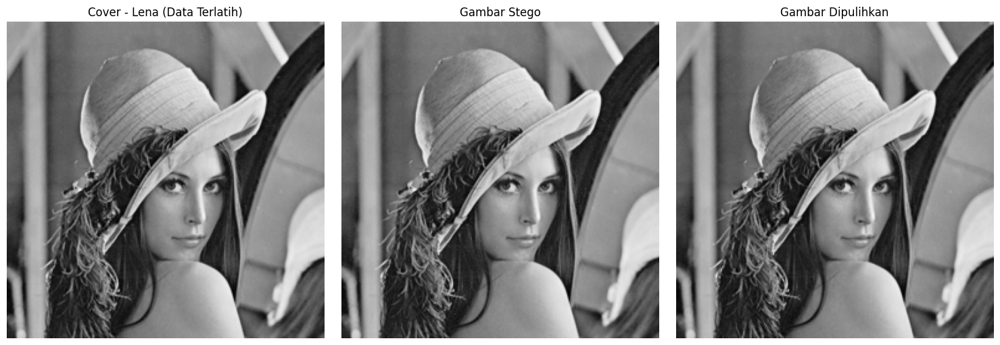
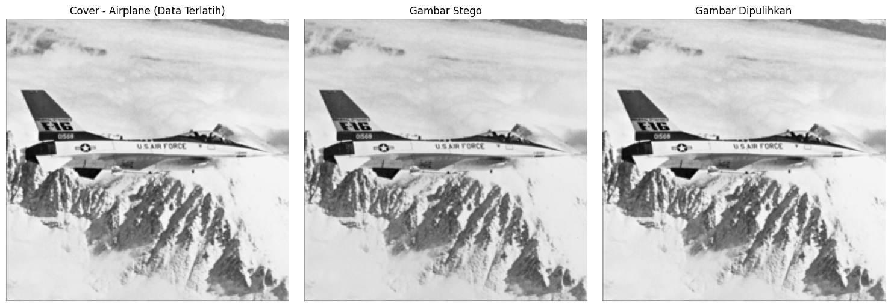
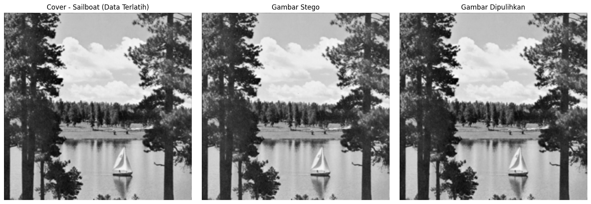
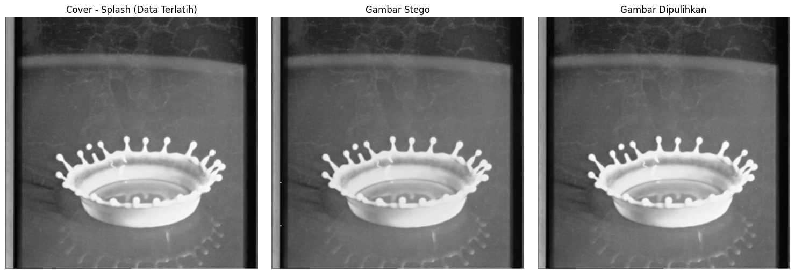
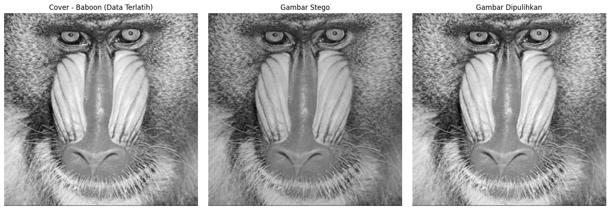
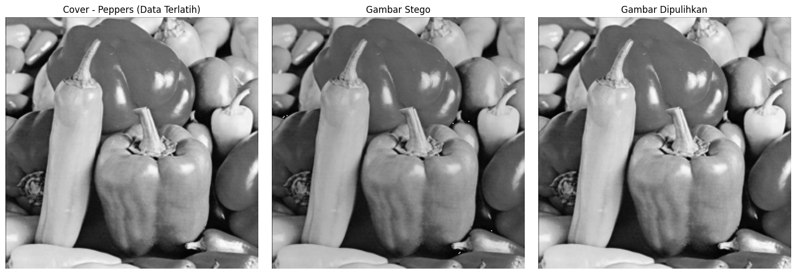
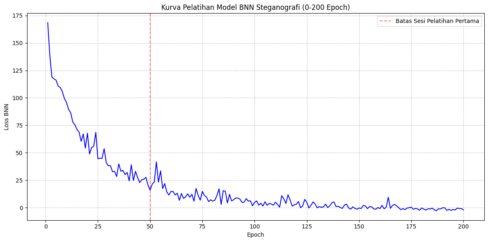

# BNN Reversible Steganography

---

## 📜 Academic Attribution

This repository and implementation are directly based on the architecture and methodologies proposed in the following academic publication:

> *"Bayesian Neural Networks for Reversible Steganography"*
> Authors: Ching-Chun Chang
> Journal: IEEE Access, 2022
> DOI: [10.1109/ACCESS.2022.3159911](https://doi.org/10.1109/ACCESS.2022.3159911)

All architectural foundations for the uncertainty-driven embedding, including the Bayesian Neural Network predictor and the variance-sorted difference expansion, are attributed to the original author.

*Acknowledgment:* The baseline residual network backbone located in `src/models/resden.py` is adapted from the open-source implementation by [Gulfam92/DeepLearning_Residual-Dense-Neural-Network](https://github.com/Gulfam92/DeepLearning_Residual-Dense-Neural-Network). The architecture has been specifically modified to output epistemic and aleatoric variance for Bayesian steganographic tasks.

---

## 📌 Project Overview

This project is an end-to-end deep learning framework for Reversible Image Steganography. It allows a secret binary message to be embedded into a grayscale cover image ($256 \times 256$). The system is completely *reversible*, meaning the exact secret message can be extracted without a single bit of error, and the original cover image is restored with 100% pixel-perfect accuracy.

By utilizing a Bayesian Neural Network (BNN), the model predicts pixel values and estimates its own uncertainty (variance). Data is intelligently hidden in pixels where the model is most confident, minimizing visual distortion (imperceptibility) while maintaining high embedding capacity.

---

## 🧬 Key Components

1. Checkerboard Context-Query Division
The image is split into two patterns: *Context* (even indices) and *Query* (odd indices). The BNN only looks at the Context pixels to predict the Query pixels. This guarantees that the receiver has the exact same Context to make identical predictions during extraction.
2. Bayesian Neural Network (BNN)
The model outputs two values for every Query pixel:

* The predicted pixel intensity ($\hat{y}$).
* The uncertainty or variance ($\sigma^2$), calculated using Monte Carlo Dropout (Epistemic) and a dedicated variance head (Aleatoric).

3. Modulo-256 Difference Expansion
To guarantee 100% reversibility and avoid pixel overflow/underflow (clipping at 0 or 255), the algorithm modulates the residual difference and applies Modulo-256 arithmetic.

---

## 🧮 Mathematical Framework

The network is trained using a custom uncertainty-weighted loss function. Instead of standard MSE, the loss penalizes errors based on the model's confidence, combined with a regularization term to prevent variance collapse:

$Loss = \frac{1}{N} \sum \left( \frac{(y - \hat{y})^2}{\sigma^2} + \lambda \log(\sigma^2) \right)$

For the embedding process, the residual $\epsilon$ (difference between true pixel and prediction) is modulated with the secret bit $m$:

$\epsilon^{\prime} = (2 \times \epsilon) + m \pmod{256}$

---

## 🚀 Getting Started

### 1. Installation

Ensure you have Python and PyTorch installed.

```bash
pip install torch torchvision numpy Pillow matplotlib requests

```

### 2. Dataset Setup

Place your grayscale training images in the `data/` directory.

```text
BNN_Steganography/
├── assets/                 
├── data/                   
│   ├── 01.lena.png
│   ├── 02.Baboon.png
│   └── ...
├── src/                    
│   ├── models/
│   │   ├── resden.py       
│   │   └── bnnloss.py      
│   └── reversible_steganography.py 
├── utils/                  
│   └── helpers.py          
├── evaluate.py             
├── train.py                
└── result/                 

```

### 3. Running Training

Train the Bayesian predictor. The script will read images from the `data/` folder and save the trained weights to the `result/` folder.

```bash
python train.py

```

### 4. Evaluation

Once the model is trained (`model_bnn.pth` is generated), use the evaluation script to embed a random binary payload, extract it, and verify the reversibility.

```bash
python evaluate.py

```

---

## 🧪 Experimental Results

The following results were obtained by training the BNN for 200 epochs. The payload size was set to approximately 0.3 bits per pixel (bpp).

### 1. Reversibility and Imperceptibility Metrics

The Aritmetika Modulo-256 guarantees that the message and image are perfectly recovered (True). The visual quality of the Stego image is measured in PSNR and MSE.

| Image Name | Message Intact | Image Recovered | MSE | PSNR (dB) |
| --- | --- | --- | --- | --- |
| Lena | True | True | 0.6204 | 50.20 |
| Sailboat | True | True | 0.5237 | 50.94 |
| Airplane | True | True | 0.7910 | 49.15 |
| Splash | True | True | 1.9156 | 45.31 |
| Baboon | True | True | 1.7721 | 45.65 |
| Peppers | True | True | 7.5769 | 39.34 |

### 2. Visual Results

The stego images maintain exceptionally high fidelity to the original covers. Below are the visual outputs generated during testing, showing the perfection of recovery and imperceptibility:

#### Lena Result


#### Airplane Result


#### Sailboat Result


#### Splash Result


#### Baboon Result


#### Peppers Result


### 3. Training Convergence

The training curve illustrates the stabilization of the BNN loss across 200 epochs.



The loss function descends smoothly, indicating that the model successfully learns to predict pixel values while accurately estimating its uncertainty bounds.

---

*Developed for academic research purposes. Last updated May 2026.*